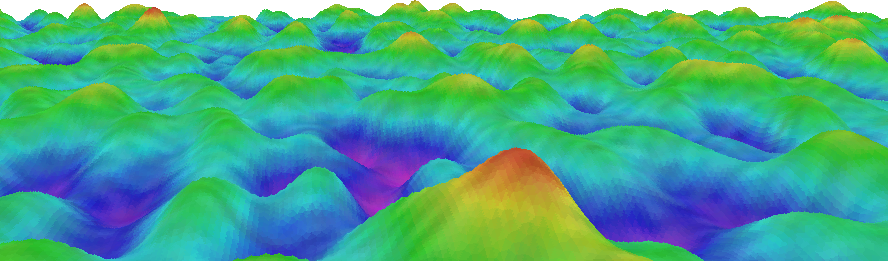

# raster3d

Short example of 3D rasterizing a scene.

Requires [Futhark](http://futhark-lang.org) and SDL2 and SDL2-ttf
libraries with associated header files.

Uses the `expand` function from the https://github.com/diku-dk/segmented
package to draw the triangles and `reduce_by_index` to simulate a
z-buffer.  The interesting code lies in `raster3d.fut` in the
`render_projected_triangles` function.

There is room for improvement!

## Demo

Run `futhark pkg sync` once and then `make && ./demo` for an interactive
terrain explorer.  Requires SDL2 and SDL2-ttf C libraries with
associated header files.

Controls:

  + Up/Down: Move forwards/backwards
  + Alt+Up/Down: Turn upwards/downwards
  + Left/Right: Turn left/right
  + Alt+Left/Right: Turn downwards left/right
  + Shift+: Move and turn faster
  + PageUp/PageDown: Increase/decrease draw distance
  + F1: Toggle text
  + ESC: Exit

## Notes

This demo was originally part of the
https://github.com/diku-dk/futhark-array19 submission, but has been
reworked to work with newer Futhark.
